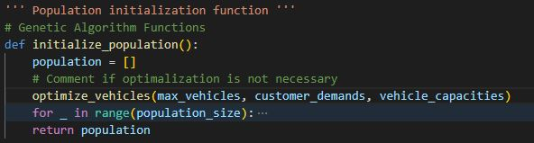
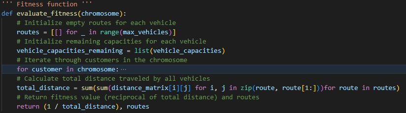
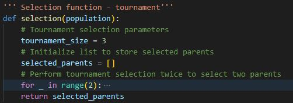
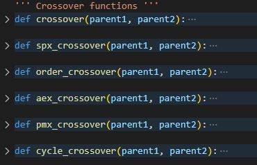
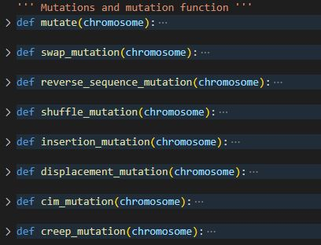
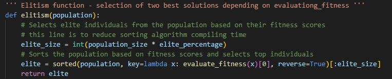
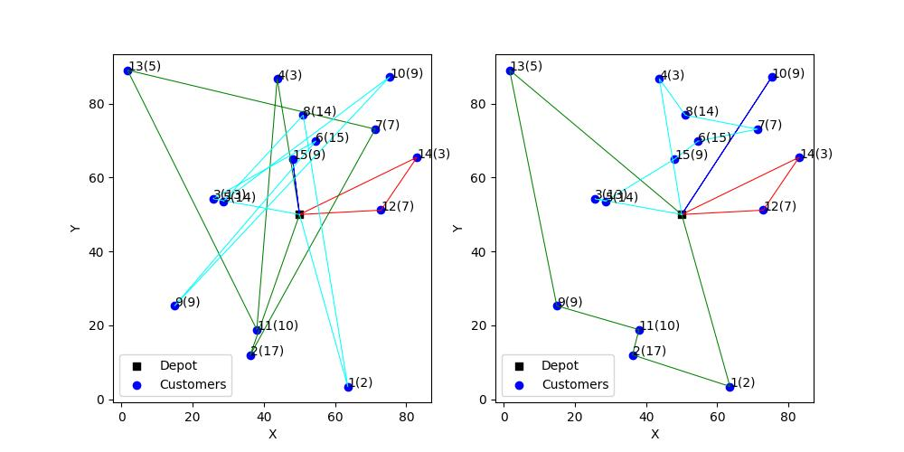
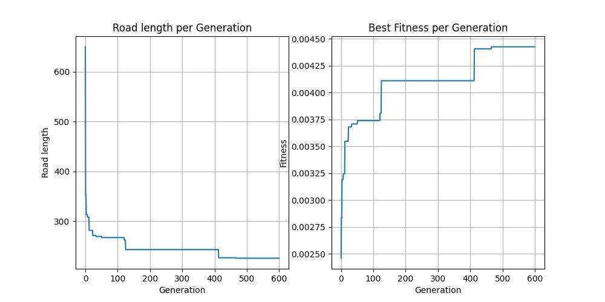
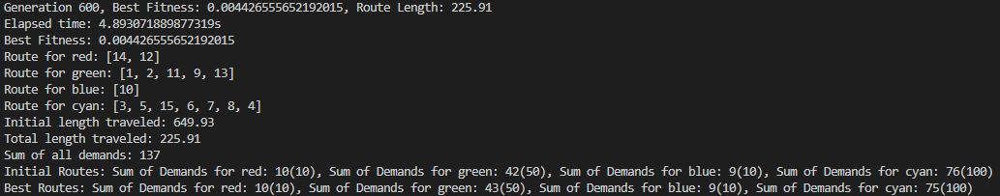

# DCVRP Solved With Genetic Algorithm
## Table of contents
- [Intorduction](#introduction)
    - [Vehicle routing problem](#vehicle-routing-problem)
    - [Genetic algorithm](#genetic-algorithm)
- [Program](#program)
    - [Genetic algorithm](#genetic-algorithm-1)
    - [Additional features](#additional-features)
- [Example solution](#example-soution)

## Introduction
### Vehicle routing problem
The Vehicle Routing Problem (VRP) is a combinatorial optimization problem where the  goal is to determine the optimal set of routes for a fleet of vehicles to serve a given set of customers or locations, subject to various constraints such as vehicle capacity, time windows, and distance or time limitations. The objective is typically to minimize the total distance traveled, the total time taken, or some other relevant cost metric, while satisfying all the constraints. Unlike traditional VRP, where customers are typically passive and have fixed demand at known locations, in DCVRP, customers are active and request service dynamically, leading to additional challenges in route planning and optimization. Efficient algorithms, including heuristic methods and metaheuristic approaches like genetic algorithms and simulated annealing, are often used to solve DCVRP and find near-optimal solutions. In DCVRP, the objective is to optimize the allocation of vehicles and their capacities to customer requests in order to minimize various costs, such as total travel time, total distance traveled, or the number of vehicles used, while satisfying all the constraints.

### Genetic algorithm
A genetic algorithm (GA) is an optimization technique inspired by the process of natural selection. It operates by creating a population of potential solutions to a problem, which are then evaluated and evolved over successive generations. Through processes such as selection, crossover, and mutation, the algorithm aims to improve solutions iteratively, mimicking the principles of Darwinian evolution. Genetic algorithms are widely used to solve complex optimization problems in various domains, offering efficient approaches for finding near-optimal solutions in large search spaces. Main features of gengetic algorithm in programming:

**Population Representation**: GAs typically represent potential solutions to the problem being solved as individuals in a population. These individuals are encoded in a way that reflects the problem domain.

**Fitness Function**: A fitness function is used to evaluate how good each individual solution is with respect to the problem's objectives. It assigns a numerical value (fitness score) to each individual, indicating its quality.

**Selection Mechanism**: GAs employ a selection mechanism to choose individuals from the population to serve as parents for the next generation. Common selection methods include roulette wheel selection, tournament selection, and rank-based selection.

**Crossover (Recombination)**: Crossover is the process of combining genetic material from selected parents to create new individuals (offspring) for the next generation. It involves exchanging or recombining parts of the genetic information between parents.

**Mutation**: Mutation introduces random changes into individual solutions to maintain genetic diversity in the population. It helps explore new regions of the search space and prevent premature convergence to suboptimal solutions.

**Replacement Strategy**: After generating offspring through crossover and mutation, a replacement strategy is used to determine which individuals from the current population and offspring population will proceed to the next generation. Strategies may include elitism (keeping the best individuals), generational replacement, or steady-state replacement.

**Termination Criteria**: GAs require termination criteria to determine when to stop the evolution process. Common termination conditions include reaching a maximum number of generations, finding a satisfactory solution, or stagnation (no significant improvement over several generations).

**Parameter Tuning**: GAs often involve several parameters that can influence their performance, such as population size, crossover rate, mutation rate, and selection pressure. Tuning these parameters can significantly impact the algorithm's effectiveness.

## Program
### Genetic algorithm
**Population Initialization**
The *initilization_population* is creating chromosomes randomly, additionaly there is *optimize_vehicle* function that takes user/randomly generated capacities of cars and divide the demands to optimize the weight being put on a car. Without the function the program is going to fully load first car, then will send the next one.

    

**Fitness function**
The *evaluate_fitness* function is optimizing for the minimum road traveled

    

**Selection Mechanism**
The *selection* function is a tournament based mechanism that takes *tournament_size* number and create offspring, mainly for chromosomes to be as diverse as possible. More infor in replacement strategy.

    

**Crossover (Recombination)**
In code there are five implemented crossovers that are randomly takes with 1/5 chance of probability: SPX, OX, AEX, PMX, CX. [Click for more info](https://www.researchgate.net/publication/268043232_Comparison_of_eight_evolutionary_crossover_operators_for_the_vehicle_routing_problem)

    

**Mutation**
Seven mutations being implemented to improve chances of being usefull in special case: swap, reverse sequenace, shuffle, insertion, displacement, central inversion mutation, creep [Click for more info](https://www.linkedin.com/pulse/mutations-genetic-algorithms-ali-karazmoodeh-u94pf/)

    

**Replacement Strategy**
The replacement strategy is constructed such that a selection of tournament offspring is first created and placed in the *new_population* variable. Then *eliticism* function being called and depending on *eliticism_percentage* takes that percentage of actual best chromosomes so that it's imposible to lose greatest solutions

    

Then the new population is being created within this line in main genetic algorithm function

    

### Additional features

• Possibility to collect surplus from customers (in case of negative value in creating demand)

• Entering user values ​​for car capacities, which may be non-uniform

• (optional) Optimization/distribution of demand for the number of cars so that each of them receives a similar value

• (optional) Forcing the car to be filled to its maximum capacity before sending another one

• Producing a diverse genotype for the next generation through tournament selection, in which the best solution does not always emerge

• Elitism, i.e. adding the best genes to the next generation

• If the car cannot be used, it remains in the warehouse

• When the car's capacity is below the average optimized for each car, the car is used to its maximum capacity and the rest are filled to the optimal value

## Example soution
As shown the solution for low number of customers are being solved really quickly, but at least is visible for human eye.

    

    

    

Console output is only to verify solution, as shown there are only key values and routes being printed. 

